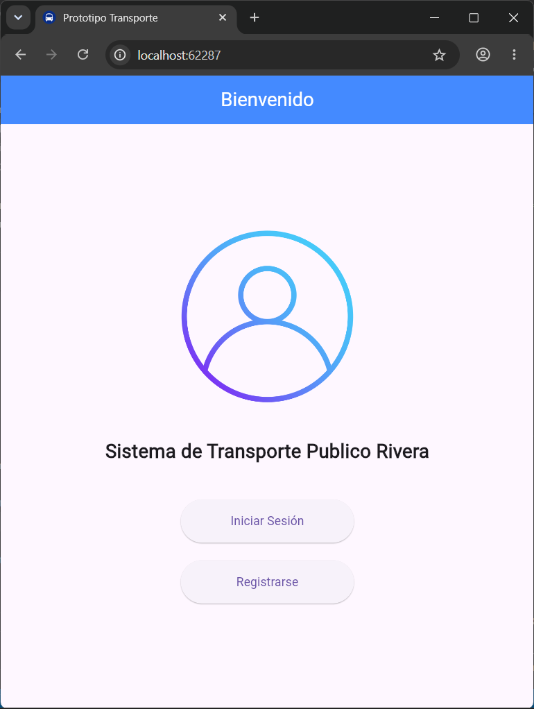
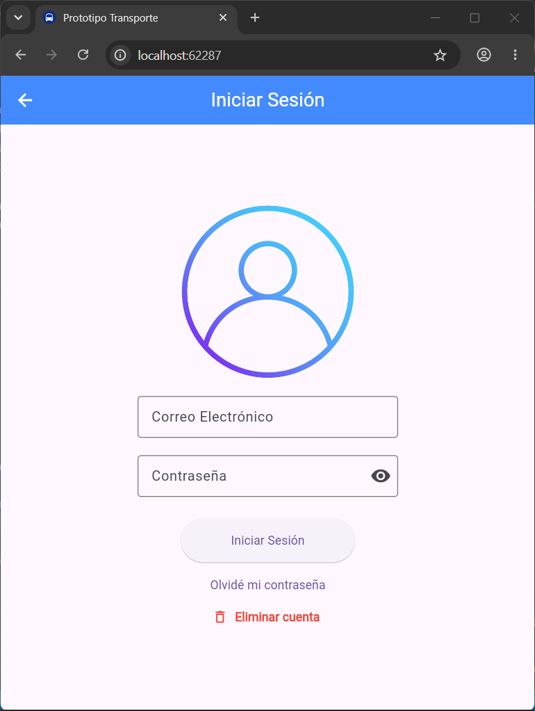
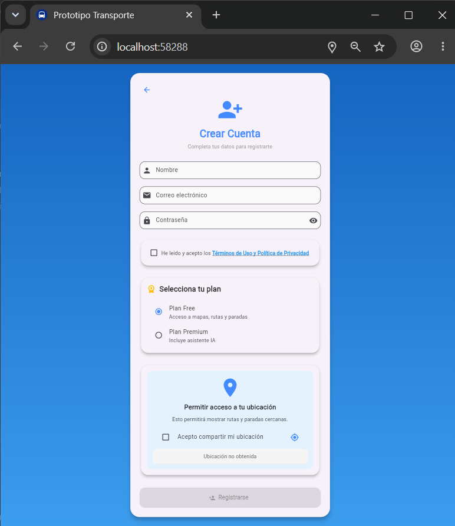
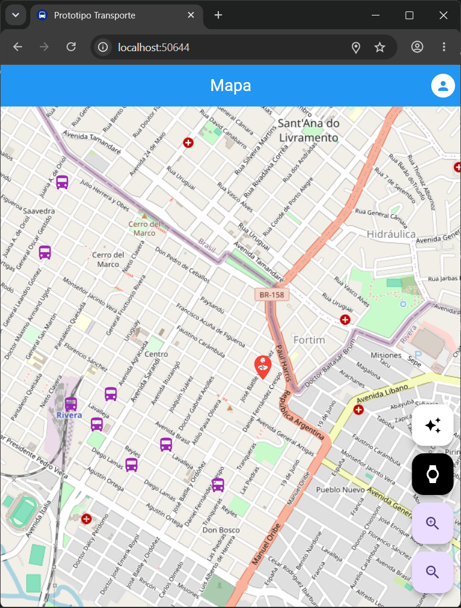

# Sistema Inteligente de Transporte Público Rivera

Aplicación móvil desarrollada en **Flutter** como parte del Trabajo de Conclusión de Carrera (TCC), orientada a mejorar la experiencia de los usuarios del transporte público mediante herramientas digitales modernas.

---

## Descripción

El sistema permite a los pasajeros consultar información del transporte público de forma rápida e intuitiva, incluyendo:

* Visualización de rutas y paradas en un mapa interactivo.
* Registro e inicio de sesión de usuarios.
* Consulta de horarios de ómnibus.
* Visualización de rutas específicas.
* Integración con una API desarrollada en PHP y MySQL.

---

## Tecnologías utilizadas

### Frontend

* Flutter
* Dart

### Backend

* PHP
* MySQL

### Librerías principales

* `flutter_map`
* `latlong2`
* `geolocator`
* `permission_handler`
* `provider`
* `http`

---

## Características principales

### Usuarios

* Registro de nuevos usuarios.
* Inicio de sesión seguro.
* Recuperación de contraseña.
* Eliminación de cuenta.

### Geolocalización

* Obtención de la ubicación actual del usuario.
* Permisos de ubicación gestionados dinámicamente.

### Mapas y rutas

* Visualización del mapa mediante OpenStreetMap.
* Marcadores de paradas.
* Cálculo y representación de rutas.
* Consulta de horarios disponibles.

---

## Capturas de pantalla

### Pantalla de inicio



---

### Inicio de sesión



---

### Registro de usuarios



---

### Mapa interactivo



---

## Instalación

### Clonar el repositorio

```bash
git clone https://github.com/tuusuario/prototipoMobile.git
```

### Instalar dependencias

```bash
flutter pub get
```

### Ejecutar la aplicación

```bash
flutter run
```

---

## Arquitectura utilizada

El proyecto sigue una estructura basada en el patrón **MVVM (Model–View–ViewModel)**, separando la lógica de negocio de la interfaz gráfica para facilitar el mantenimiento y la escalabilidad del sistema.

---

## Autores

**Irina Muñoz**

Trabajo de Conclusión de Carrera – Tecnólogo en Informática.

---

## Licencia

Este proyecto fue desarrollado con fines académicos y educativos.
